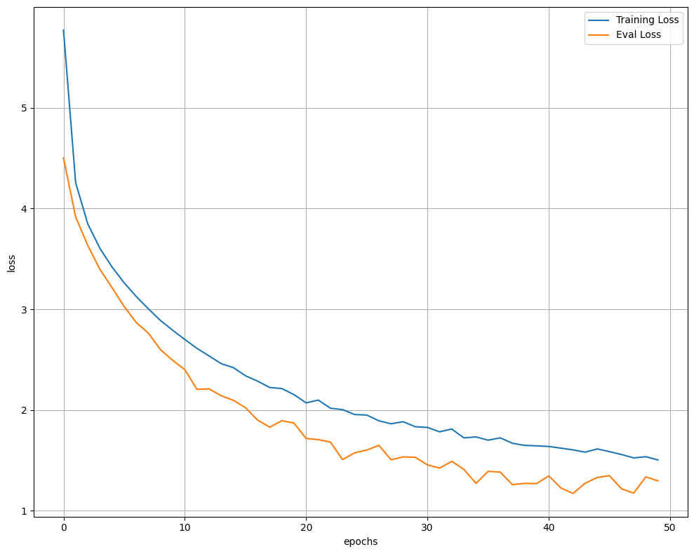
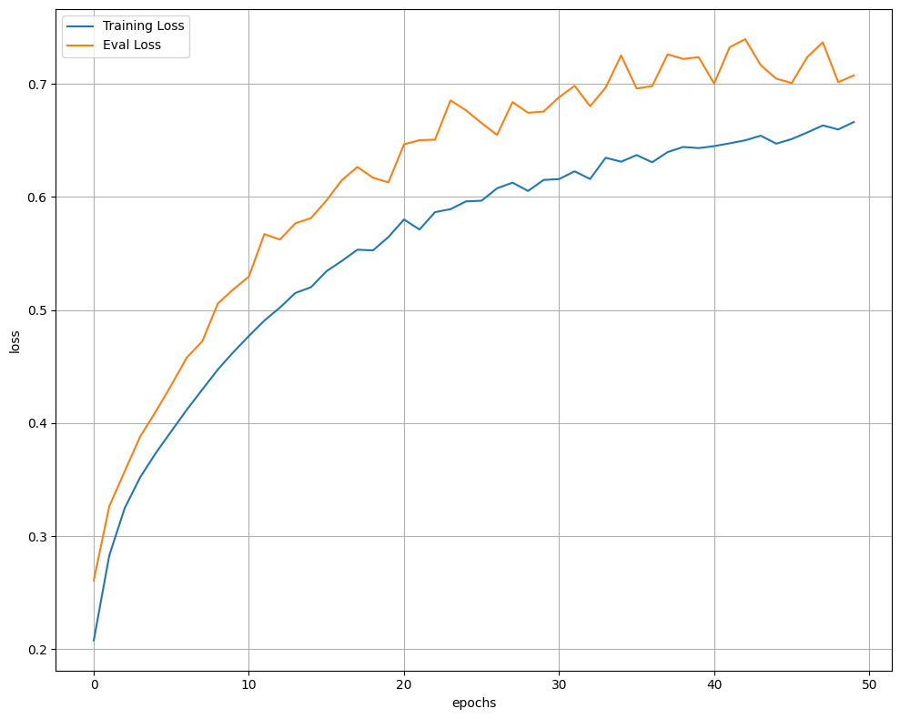

# Transformer
Code for training a Transformer model. I used korean dataset

## Final score

- Train Loss: 1.506 | Train Acc: 66.626% || Eval Loss: 1.298 | Eval Acc: 70.746%

## Training
<table>
	<tr>
		<td align="center">
			
			
<strong>Loss</strong>

		</td>
		<td align="center">
			
			
<strong>Accuracy</strong>

		</td>
	</tr>
</table>